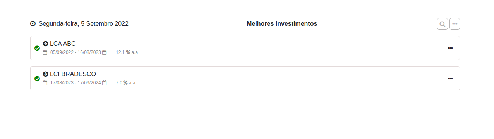
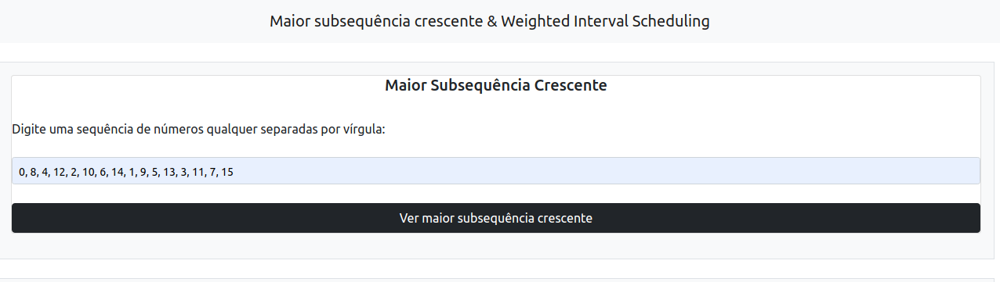
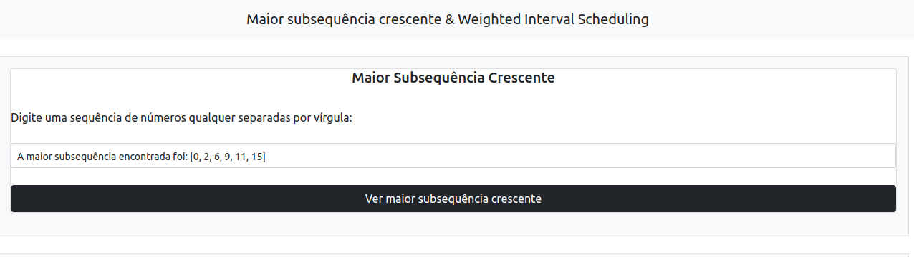

**PD_LIS_and_Interval** 

Temas:
 - PD
 

# LIS and Interval

**Trabalho**: Programação dinâmica<br>
**Conteúdo da Disciplina**: Programação dinâmica<br>

## Alunos
|Matrícula | Aluno |
| -- | -- |
| 18/0024868  |  Mateus Moreira Lima |
| 19/0044390  |  Victor Rayan Adriano Ferreira |

## Sobre 
O nosso trabalho implementa dois algoritmos de programação dinâmica, Maior Subsequência Crescente(LIS) e o Weighted Interval Scheduling (WIS). O objetivo do LIS é dada uma sequência encontrar a subsequência que seja a maior possível. Já o objetivo do Weighted Interval Scheduling é encontrar tarefas com maior prioridade e priorizar o maior número de tarefas, para isso esses dois algoritmos utilizam um tipo de memorização, senão se tornariam a algo muito parecido como força bruta. 

No caso do WIS, enxergamos a possibilidade de utilização na priorização de LCI's/LCA's (Letra de Crédito Imobiliário/ Letra de Crédito do Agronegócio), pois elas são tipos de investimestimento com um prazo para início da aplicação e liquidez apenas no vencimento e um rendimento (prioridade), ou seja, ao investirmos em LCI's/LCA's buscamos alocar os recursos financeiros no maior número de LCI's/LCA's e com o maior retorno, o que a nossa aplicação se compromete a fazer, já que um grande problema ao se procurar rendas fixas desse tipo é a diversidade de aplicações em diversos bancos e com diferentes rendimentos.

Portanto, por exemplo um insider com um bom direcionamento sobre o futuro dos retornos dos rendimentos das LCI's/LCA's pode se antecipar buscando alocar os seus recursos naquelas que tenham o melhor retorno.

## Screenshots
Tela inicial da aplicação:


Melhor aplicação:



Uma sequência aleatória para cadastro da maior subsequência crescente:



Maior subsequência encontrada:


## Instalação 
**Linguagem**: Python 3<br>
**Framework**: Django e Bootstrap<br>

Para rodar a aplicação é necessário ter instalado em sua máquina o python 3 e o Django.

### Rode o comando a seguir para instalar as dependências:
```console
$ pip install -r requirements.txt
```
(caso esteja utilizando pip3)
```console
$ pip3 install -r requirements.txt
```

### Para rodar a aplicação:

```console
$ python manage.py runserver
```
ou
```console
$ python3 manage.py runserver
```

### Acessar a url: 
http://127.0.0.1:8000/


## Uso 
### Maior subsequência crescente:
1. Coloque os números separados por vírgula, na ordem desejada, exemplo: 
0, 8, 4, 12, 2, 10, 6, 14, 1, 9, 5, 13, 3, 11, 7, 15
2. Clique em Ver maior subsequência crescente.


### Melhores Aplicações:
1. Utilize os campos para cadastrar o nome da LCI/LCA, Data inicial da aplicação e Data final, coloque o rendimento no formato: 11.5
2. Clique em Nova Tarefa+ para adicionar mais um campo para cadastro de outra aplicação.
3. Após todas as aplicações cadastradas utilize o botão Submeter tarefas para ver quais aplicações podem ser mais úteis.

## Apresentação

[Video Apresentação](apresentacao/video_PD_LIS_and_Interval.mp4)

